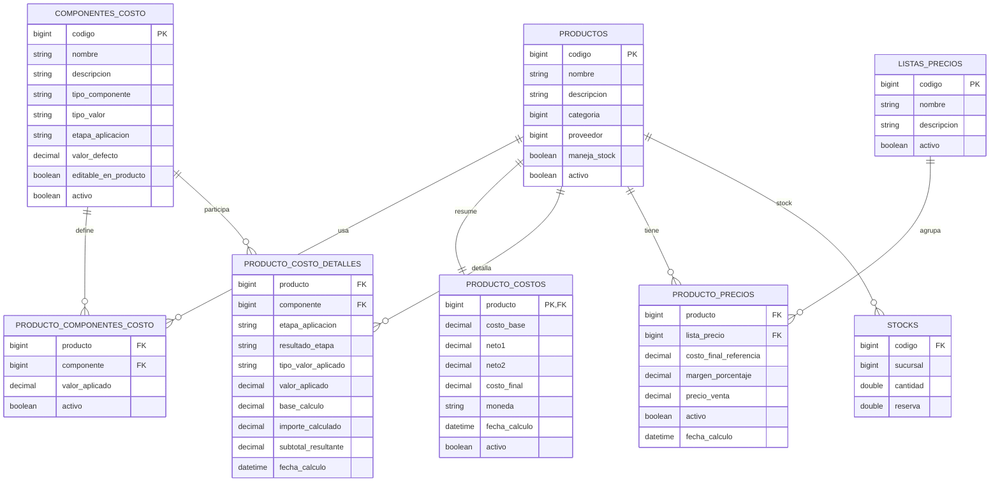

# Modelo de Calculo por Etapas

Fecha: 2026-03-26

## Objetivo

Dejar definida de forma clara la logica de calculo de costos para evitar ambiguedades en:

- donde aplica cada componente
- que base usa cada componente
- como se forma el costo final

Este documento fija una forma de trabajo mas explicita que la implementacion actual.

## Idea central

El calculo no debe pensarse como una cadena libre e infinita de componentes que se aplican uno atras de otro sobre un subtotal cambiante.

Debe pensarse como un flujo por etapas fijas.

## Etapas del calculo

El modelo queda definido con estos niveles:

1. `costoBase`
2. `neto1`
3. `neto2`
4. `costoFinal`

Interpretacion:

- `costoBase` es el punto de partida
- `neto1` es el resultado de aplicar todos los componentes de etapa 1
- `neto2` es el resultado de aplicar todos los componentes de etapa 2
- `costoFinal` es el resultado de aplicar todos los componentes finales sobre `neto2`

## Regla principal

Todos los componentes de una misma etapa se calculan sobre la misma base de esa etapa.

No se recalcula la base entre componente y componente dentro de la misma etapa.

Eso significa:

- etapa 1: todos calculan sobre `costoBase`
- etapa 2: todos calculan sobre `neto1`
- etapa final: todos calculan sobre `neto2`

## Etapa 1

Componentes que afectan directamente al `costoBase`.

Ejemplos posibles:

- merma
- ajustes iniciales
- descuentos porcentuales iniciales
- recargos iniciales

Formula conceptual:

```text
neto1 = costoBase + suma(componentes de etapa 1 calculados sobre costoBase)
```

Ejemplo:

```text
costoBase = 100
merma = 2%
ajuste = 3%
descuento = -5%

neto1 = 100 + (100 * 2%) + (100 * 3%) + (100 * -5%)
neto1 = 100
```

## Etapa 2

Componentes que afectan a `neto1`.

Ejemplos posibles:

- impuestos internos
- tasas
- fletes
- recargos logísticos
- descuentos fijos o porcentuales de segunda capa

Formula conceptual:

```text
neto2 = neto1 + suma(componentes de etapa 2 calculados sobre neto1)
```

Ejemplo:

```text
neto1 = 100
tasa = 3%
flete = 10
descuento fijo = -4

neto2 = 100 + (100 * 3%) + 10 + (-4)
neto2 = 109
```

## Etapa final

Componentes que afectan a `neto2`.

Ejemplos posibles:

- IVA 21
- IVA 10.5
- otros impuestos finales
- otros recargos finales si el negocio los necesita

Formula conceptual:

```text
costoFinal = neto2 + suma(componentes finales calculados sobre neto2)
```

Ejemplo:

```text
neto2 = 109
IVA = 21%

costoFinal = 109 + (109 * 21%)
costoFinal = 131.89
```

## Regla sobre impuestos

El sistema no debe asumir que todos los productos tienen IVA.

Tampoco debe asumir que todos los productos tienen la misma estructura impositiva.

Cada producto puede tener:

- IVA 21
- IVA 10.5
- no tener IVA
- tasas municipales especificas
- impuestos internos
- recargos especiales
- descuentos

La seleccion de componentes debe ser libre por producto.

## Regla sobre componentes obligatorios

No debe existir una obligacion global del tipo:

- todos los productos deben tener IVA
- todos los productos deben tener el mismo impuesto
- todos los productos deben tener todos los componentes

Lo correcto es:

- el catalogo maestro define que es cada componente y como se calcula
- el producto define cuales usa realmente

## Regla sobre descuentos

Los descuentos deben permitirse.

Eso implica aceptar:

- porcentajes negativos
- importes fijos negativos

Ejemplos:

- descuento porcentual: `-15%`
- descuento fijo: `-200.00`

Por lo tanto, no todos los componentes deben restringirse a valores positivos.

## Consecuencia para el modelo de datos

El concepto actual de `modoBase` no alcanza si queda ambiguo.

La recomendacion es que el modelo maestro de componente exprese explicitamente la etapa de aplicacion.

## Opcion recomendada

Cada `ComponenteCosto` deberia definir al menos:

- `etapaAplicacion`
- `tipoValor`
- `tipoComponente`
- `valorDefecto`
- `editableEnProducto`

### Valores propuestos para `etapaAplicacion`

- `ETAPA_1`
- `ETAPA_2`
- `ETAPA_FINAL`

La base de calculo se deduce directamente:

- `ETAPA_1` -> base = `costoBase`
- `ETAPA_2` -> base = `neto1`
- `ETAPA_FINAL` -> base = `neto2`

Esto elimina la necesidad de interpretar nombres como `"IVA"` para decidir comportamiento.

## Consecuencia para el algoritmo

El backend deberia calcular asi:

1. tomar `costoBase`
2. calcular todos los componentes de `ETAPA_1` sobre `costoBase`
3. obtener `neto1`
4. calcular todos los componentes de `ETAPA_2` sobre `neto1`
5. obtener `neto2`
6. calcular todos los componentes de `ETAPA_FINAL` sobre `neto2`
7. obtener `costoFinal`

## Formula general

### Si el componente es porcentual

```text
importe = baseEtapa * valorAplicado / 100
```

### Si el componente es fijo

```text
importe = valorAplicado
```

### Si el componente es descuento

Se representa con valor negativo:

- porcentual negativo
- fijo negativo

No hace falta un tipo especial separado solo por ser descuento.

## Ventajas de este modelo

- evita ambiguedad
- evita depender del nombre del componente
- permite productos con estructuras fiscales distintas
- permite descuentos reales
- hace mas facil explicar el calculo al operador
- hace mas facil auditar el resultado
- hace mas facil programar frontend y backend con la misma logica

## Diferencia con la implementacion actual

La implementacion actual todavia esta mas cerca de una secuencia de componentes ordenados con ciertos comportamientos inferidos.

Este modelo por etapas es mas estricto y mas claro.

La recomendacion es usar este documento como referencia para el siguiente refactor del calculo.

## Decision conceptual cerrada en esta etapa

La idea preferida para el sistema es:

- calculo por etapas fijas
- seleccion libre de componentes por producto
- soporte de porcentajes y montos fijos
- soporte de valores negativos para descuentos
- sin obligatoriedad global de IVA u otros componentes

## Decisiones finales cerradas

Quedan cerradas estas reglas para la implementacion:

1. `etapaAplicacion` reemplaza completamente a `modoBase`
2. `prioridadAplicacion` se elimina del calculo y del modelo vigente
3. mientras mas datos calculados queden persistidos, mejor
4. cada etapa soporta componentes:
   - porcentuales
   - fijos
   - positivos
   - negativos

## Reglas operativas adicionales

- el calculo de costo usa `4 decimales`
- el precio de venta usa `2 decimales`
- no puede existir el mismo componente dos veces en un mismo producto
- si se necesitan dos descuentos, deben existir como componentes distintos del catalogo
- un `ComponenteCosto` que este en uso por algun producto no puede desactivarse
- para desactivar un componente, primero debe dejar de usarse en todos los productos

## Estructura de entidades propuesta

La idea es reutilizar el modelo actual donde sirva y corregirlo donde hoy no expresa bien el calculo por etapas.

## 1. `Producto`

Se mantiene como entidad base del articulo.

Responsabilidad:

- identidad del producto
- datos operativos
- estado

Campos actuales que siguen sirviendo:

- `codigo`
- `nombre`
- `descripcion`
- `categoria`
- `proveedor`
- `manejaStock`
- `activo`
- fechas

No debe guardar:

- costo
- netos intermedios
- precios
- componentes de costo

## 2. `ComponenteCosto`

Debe reemplazar la semantica ambigua actual y pasar a expresar claramente a que etapa pertenece cada componente.

### Estructura propuesta

- `codigo`
- `nombre`
- `descripcion`
- `tipoComponente`
- `tipoValor`
- `etapaAplicacion`
- `valorDefecto`
- `editableEnProducto`
- `activo`

### Campos que sobran o deben cambiar

- `modoBase` se elimina
- `prioridadAplicacion` se elimina
- `obligatorio` sobra como regla global si el negocio permite que cada producto decida sus componentes

### Regla nueva

El dato importante pasa a ser:

- `etapaAplicacion`

Valores propuestos:

- `ETAPA_1`
- `ETAPA_2`
- `ETAPA_FINAL`

La base se deduce por etapa:

- `ETAPA_1` -> `costoBase`
- `ETAPA_2` -> `neto1`
- `ETAPA_FINAL` -> `neto2`

### Sobre el orden interno

Si todos los componentes de una etapa usan la misma base, el orden dentro de la etapa deja de afectar el resultado matematico.

Por eso:

- `prioridadAplicacion` se elimina
- para mostrar una lista se puede ordenar por `codigo` o `nombre`, pero eso ya no cambia el resultado

## 3. `ProductoComponenteCosto`

Debe mantenerse, pero con una semantica mas simple.

Responsabilidad:

- indicar que componentes usa el producto
- guardar el valor aplicado en ese producto

### Estructura propuesta

- `producto`
- `componente`
- `valorAplicado`
- `activo`
- fechas

### Regla

- un producto puede tener cero o muchos componentes
- si no tiene IVA, simplemente no hay componente IVA
- si tiene IVA 10.5 o 21, se define por el componente elegido
- no puede repetir el mismo componente dentro del mismo producto

## 4. `ProductoCosto`

Debe seguir siendo el resumen vigente del costo, pero ahora expresando tambien los netos intermedios.

### Estructura propuesta

- `producto`
- `costoBase`
- `neto1`
- `neto2`
- `costoFinal`
- `moneda`
- `fechaCalculo`
- `activo`
- fechas

### Cambio importante respecto al modelo actual

Hoy solo guarda:

- `costoBase`
- `costoFinal`

Con el modelo por etapas deberia guardar tambien:

- `neto1`
- `neto2`

porque son parte del resultado funcional del calculo y facilitan auditoria, lectura y depuracion.

## 5. `ProductoCostoDetalle`

Debe seguir existiendo como trazabilidad vigente del calculo.

Pero debe representar claramente:

- en que etapa estuvo el componente
- que base se uso
- que importe agrego o descuento

### Estructura propuesta

- `producto`
- `componente`
- `etapaAplicacion`
- `tipoValorAplicado`
- `valorAplicado`
- `baseCalculo`
- `importeCalculado`
- `subtotalResultante`
- `fechaCalculo`

### Campos que sobran o deben cambiar

- `modoBaseAplicado` deja de ser necesario si la base se deduce por etapa
- `ordenAplicado` deja de ser secundario o prescindible

### Regla

Debe existir una fila vigente por:

- `producto + componente`

Y en esa fila debe quedar claro:

- sobre que base trabajo
- cuanto sumo o resto
- cual fue el subtotal de salida de la etapa
- cual fue el resultado objetivo de esa etapa:
  - `NETO1`
  - `NETO2`
  - `COSTO_FINAL`

## 6. `ProductoPrecio`

Se mantiene.

### Estructura propuesta

- `producto`
- `listaPrecio`
- `costoFinalReferencia`
- `margenPorcentaje`
- `precioVenta`
- `activo`
- `fechaCalculo`
- fechas

### Regla

El precio se calcula siempre desde:

- `costoFinal`

No desde `neto1`
No desde `neto2`

## 7. `ListaPrecio`

Se mantiene como esta.

No necesita cambios estructurales para este modelo.

## 8. `Stock`

Se mantiene como esta.

No forma parte del calculo de costo, pero si del flujo operativo del producto completo.

## Entidades que sobran para este modelo

En el estado actual y para este enfoque, sobran o no hacen falta:

- cualquier estructura que intente deducir reglas por nombre del componente
- reglas globales de obligatoriedad del tipo "todos deben tener IVA"
- historial de costo/precio por ahora, hasta que se rehaga sobre este modelo

## Resumen de cambios respecto al modelo actual

### `ComponenteCosto`

Cambiar:

- dejar de depender de `modoBase` ambiguo
- dejar de depender de `prioridadAplicacion` para el resultado
- agregar `etapaAplicacion`
- eliminar `obligatorio` como regla global fuerte

### `ProductoCosto`

Agregar:

- `neto1`
- `neto2`

### `ProductoCostoDetalle`

Cambiar:

- usar `etapaAplicacion`
- eliminar la necesidad de `modoBaseAplicado`
- volver opcional o prescindible `ordenAplicado`

### `ProductoComponenteCosto`

Mantener:

- `producto`
- `componente`
- `valorAplicado`

## UML / ER del modelo propuesto



## Lectura funcional del UML

- `Producto` es la entidad principal
- `ComponenteCosto` define la semantica del componente
- `ProductoComponenteCosto` decide si un producto usa ese componente y con que valor
- `ProductoCosto` guarda el resumen final del calculo por etapas
- `ProductoCostoDetalle` deja trazabilidad de cada componente aplicado
- `ProductoPrecio` guarda los precios por lista
- `Stock` sigue por fuera del calculo, pero asociado al producto

## Estado de definicion

Los puntos conceptuales necesarios para implementar el modelo ya quedaron cerrados:

- `etapaAplicacion` es el eje del calculo
- `prioridadAplicacion` se elimina
- `ProductoCostoDetalle` debe guardar tambien el resultado de etapa
- en una misma etapa pueden convivir porcentajes, fijos y descuentos negativos
